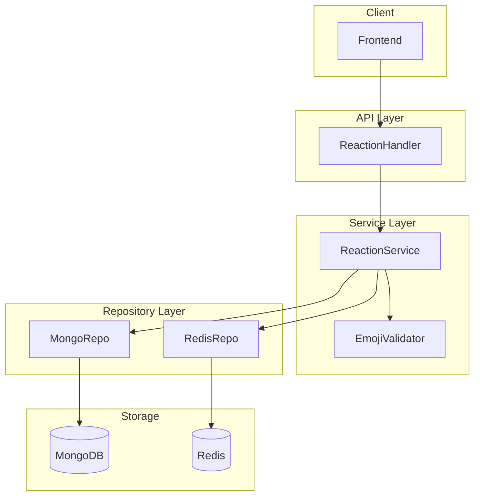

# Design Document: Emoji Reactions System

## Overview

本设计为 Entry 和 Comment 实现类似 GitHub 的 emoji reaction 系统。系统采用双存储架构：
- **MongoDB**: 存储 reaction 聚合统计（每个目标有哪些 emoji 及其数量）
- **Redis**: 存储用户维度的 reaction 记录（用户对哪些目标发了什么 emoji）

这种设计优化了查询场景：
- 查看某个 Entry/Comment 的 reaction 统计 → 直接从 MongoDB 读取
- 批量查询时获取当前用户的 reactions → 从 Redis 读取

## Architecture



## Components and Interfaces

### 1. Data Models (model/reaction.go)

```go
// TargetType 定义 reaction 目标类型
type TargetType string

const (
    TargetEntry   TargetType = "entry"
    TargetComment TargetType = "comment"
)

// ReactionSummary 存储在 MongoDB 中的 reaction 聚合统计
type ReactionSummary struct {
    ID         primitive.ObjectID `bson:"_id,omitempty" json:"id"`
    TargetID   primitive.ObjectID `bson:"target_id" json:"target_id"`
    TargetType TargetType         `bson:"target_type" json:"target_type"`
    Reactions  map[string]int     `bson:"reactions" json:"reactions"` // emoji -> count
    UpdatedAt  time.Time          `bson:"updated_at" json:"updated_at"`
}

// ReactionResponse API 返回的 reaction 信息
type ReactionResponse struct {
    Reactions     map[string]int `json:"reactions"`      // emoji -> count
    UserReactions []string       `json:"user_reactions"` // 当前用户已添加的 emoji 列表
}
```

### 2. Redis Repository (repository/redis.go)

```go
type RedisRepo struct {
    client *redis.Client
}

func NewRedisRepo(addr, password string, db int) (*RedisRepo, error)
func (r *RedisRepo) Close() error
func (r *RedisRepo) Ping(ctx context.Context) error

// User Reaction 操作
func (r *RedisRepo) AddUserReaction(ctx context.Context, userID, targetType, targetID, emoji string) error
func (r *RedisRepo) RemoveUserReaction(ctx context.Context, userID, targetType, targetID, emoji string) error
func (r *RedisRepo) HasUserReaction(ctx context.Context, userID, targetType, targetID, emoji string) (bool, error)
func (r *RedisRepo) GetUserReactionsForTarget(ctx context.Context, userID, targetType, targetID string) ([]string, error)
func (r *RedisRepo) GetUserReactionsForTargets(ctx context.Context, userID string, targets []struct{Type, ID string}) (map[string][]string, error)
```

### 3. MongoDB Repository Extensions (repository/mongo.go)

```go
// Reaction Summary 操作
func (r *MongoRepo) GetReactionSummary(ctx context.Context, targetType TargetType, targetID primitive.ObjectID) (*ReactionSummary, error)
func (r *MongoRepo) GetReactionSummaries(ctx context.Context, targets []struct{Type TargetType; ID primitive.ObjectID}) ([]ReactionSummary, error)
func (r *MongoRepo) IncrementReaction(ctx context.Context, targetType TargetType, targetID primitive.ObjectID, emoji string) error
func (r *MongoRepo) DecrementReaction(ctx context.Context, targetType TargetType, targetID primitive.ObjectID, emoji string) error
func (r *MongoRepo) DeleteReactionSummary(ctx context.Context, targetType TargetType, targetID primitive.ObjectID) error
```

### 4. Emoji Validator (service/emoji.go)

```go
type EmojiValidator struct{}

func NewEmojiValidator() *EmojiValidator
func (v *EmojiValidator) IsValidEmoji(s string) bool
```

### 5. Reaction Service (service/reaction.go)

```go
type ReactionService struct {
    mongoRepo      *repository.MongoRepo
    redisRepo      *repository.RedisRepo
    emojiValidator *EmojiValidator
}

func NewReactionService(mongoRepo *repository.MongoRepo, redisRepo *repository.RedisRepo) *ReactionService

func (s *ReactionService) AddReaction(ctx context.Context, userID, targetType, targetID, emoji string) error
func (s *ReactionService) RemoveReaction(ctx context.Context, userID, targetType, targetID, emoji string) error
func (s *ReactionService) GetReactions(ctx context.Context, userID, targetType, targetID string) (*ReactionResponse, error)
func (s *ReactionService) GetReactionsBatch(ctx context.Context, userID string, targets []struct{Type, ID string}) (map[string]*ReactionResponse, error)
```

### 6. Reaction Handler (handler/reaction.go)

```go
type ReactionHandler struct {
    reactionSvc *service.ReactionService
    mongoRepo   *repository.MongoRepo
}

func NewReactionHandler(reactionSvc *service.ReactionService, mongoRepo *repository.MongoRepo) *ReactionHandler

func (h *ReactionHandler) Add(c *gin.Context)       // POST /api/v1/reactions
func (h *ReactionHandler) Remove(c *gin.Context)    // DELETE /api/v1/reactions
func (h *ReactionHandler) Get(c *gin.Context)       // GET /api/v1/reactions
func (h *ReactionHandler) GetBatch(c *gin.Context)  // POST /api/v1/reactions/batch
```

## Data Models

### MongoDB: reaction_summaries Collection

```json
{
  "_id": ObjectId("..."),
  "target_id": ObjectId("..."),
  "target_type": "entry" | "comment",
  "reactions": {
    "👍": 5,
    "❤️": 3,
    "😄": 1
  },
  "updated_at": ISODate("...")
}
```

索引：
- `{ target_type: 1, target_id: 1 }` - 唯一索引，用于快速查询

### Redis: User Reactions

Key 格式: `user_reactions:{user_id}`
类型: Set
Value: `{target_type}:{target_id}:{emoji}`

示例:
```
Key: user_reactions:507f1f77bcf86cd799439011
Members:
  - entry:507f1f77bcf86cd799439012:👍
  - entry:507f1f77bcf86cd799439012:❤️
  - comment:507f1f77bcf86cd799439013:😄
```

## API Endpoints

### POST /api/v1/reactions - 添加 Reaction

Request:
```json
{
  "target_id": "507f1f77bcf86cd799439012",
  "target_type": "entry",
  "emoji": "👍"
}
```

Response (201):
```json
{
  "code": 0,
  "data": {
    "reactions": { "👍": 6, "❤️": 3 },
    "user_reactions": ["👍"]
  }
}
```

### DELETE /api/v1/reactions - 移除 Reaction

Request:
```json
{
  "target_id": "507f1f77bcf86cd799439012",
  "target_type": "entry",
  "emoji": "👍"
}
```

Response (200):
```json
{
  "code": 0,
  "data": {
    "reactions": { "👍": 5, "❤️": 3 },
    "user_reactions": []
  }
}
```

### GET /api/v1/reactions - 查询单个目标的 Reactions

Query Parameters:
- `target_id`: 目标 ID
- `target_type`: "entry" 或 "comment"

Response (200):
```json
{
  "code": 0,
  "data": {
    "reactions": { "👍": 5, "❤️": 3 },
    "user_reactions": ["👍"]
  }
}
```

### POST /api/v1/reactions/batch - 批量查询 Reactions

Request:
```json
{
  "targets": [
    { "target_id": "507f1f77bcf86cd799439012", "target_type": "entry" },
    { "target_id": "507f1f77bcf86cd799439013", "target_type": "comment" }
  ]
}
```

Response (200):
```json
{
  "code": 0,
  "data": {
    "entry:507f1f77bcf86cd799439012": {
      "reactions": { "👍": 5 },
      "user_reactions": ["👍"]
    },
    "comment:507f1f77bcf86cd799439013": {
      "reactions": { "😄": 2 },
      "user_reactions": []
    }
  }
}
```

## Error Handling

| 场景 | HTTP Status | Error Message |
|------|-------------|---------------|
| 未登录 | 401 | unauthorized |
| 目标不存在 | 404 | entry not found / comment not found |
| 无效的 emoji | 400 | invalid emoji |
| 无效的 target_type | 400 | invalid target_type |
| 重复添加相同 reaction | 409 | reaction already exists |
| 移除不存在的 reaction | 404 | reaction not found |
| 批量查询超过 100 | 400 | too many targets (max 100) |
| Redis 连接失败 | 500 | internal server error |
| MongoDB 操作失败 | 500 | internal server error |


## Correctness Properties

*A property is a characteristic or behavior that should hold true across all valid executions of a system—essentially, a formal statement about what the system should do. Properties serve as the bridge between human-readable specifications and machine-verifiable correctness guarantees.*

### Property 1: Add Reaction Completeness

*For any* valid user, target (entry or comment), and emoji, when a reaction is added:
- The user's reaction record SHALL exist in Redis
- The target's reaction count for that emoji SHALL increase by 1 in MongoDB

**Validates: Requirements 1.1, 1.2**

### Property 2: Remove Reaction Completeness

*For any* existing user reaction, when the reaction is removed:
- The user's reaction record SHALL be removed from Redis
- The target's reaction count for that emoji SHALL decrease by 1 in MongoDB

**Validates: Requirements 2.1, 2.2**

### Property 3: Add Reaction Idempotence

*For any* user, target, and emoji, adding the same reaction twice SHALL result in an error on the second attempt, and the reaction count SHALL remain unchanged.

**Validates: Requirements 1.3**

### Property 4: Multiple Reactions Per Target

*For any* user and target, the user SHALL be able to add multiple different emojis, and each emoji SHALL be tracked independently.

**Validates: Requirements 1.4**

### Property 5: Emoji Validation

*For any* input string, the system SHALL accept it as a valid reaction if and only if it is a valid emoji character. Non-emoji strings SHALL be rejected with a 400 error.

**Validates: Requirements 1.7, 5.4**

### Property 6: Zero Count Cleanup

*For any* target and emoji, when the reaction count reaches zero after removal, that emoji key SHALL be removed from the reactions map.

**Validates: Requirements 2.3**

### Property 7: Remove Non-existent Reaction Error

*For any* user, target, and emoji where no reaction exists, attempting to remove it SHALL return a 404 error.

**Validates: Requirements 2.4**

### Property 8: Target Existence Validation

*For any* non-existent target ID, attempting to add or remove a reaction SHALL return a 404 error.

**Validates: Requirements 1.5, 2.5**

### Property 9: Query Reaction Completeness

*For any* target with reactions, querying its reactions SHALL return:
- All emoji types and their correct counts
- For logged-in users, the list of emojis they have added

**Validates: Requirements 3.1, 3.2**

### Property 10: Batch Query Completeness

*For any* list of targets (up to 100), batch querying SHALL return the correct reaction summary for each target, including user reactions for logged-in users.

**Validates: Requirements 4.1, 4.2, 4.4**

### Property 11: Add-Remove Round Trip

*For any* user, target, and emoji, adding a reaction and then removing it SHALL result in the same state as before the addition (reaction count unchanged, no user reaction record).

**Validates: Requirements 1.1, 1.2, 2.1, 2.2**

## Testing Strategy

### Property-Based Testing

使用 [gopter](https://github.com/leanovate/gopter) 作为 Go 的属性测试库。

每个属性测试配置：
- 最少 100 次迭代
- 使用生成器创建随机的用户 ID、目标 ID、emoji

### Generators

```go
// 生成有效的 ObjectID
func GenObjectID() gopter.Gen

// 生成有效的 emoji
func GenEmoji() gopter.Gen

// 生成无效的 emoji（非 emoji 字符串）
func GenInvalidEmoji() gopter.Gen

// 生成 target type
func GenTargetType() gopter.Gen
```

### Unit Tests

单元测试覆盖以下场景：

1. **EmojiValidator**
   - 验证常见 emoji（👍、❤️、😄 等）
   - 拒绝普通文本
   - 拒绝空字符串
   - 处理组合 emoji（如 👨‍👩‍👧‍👦）

2. **Redis Repository**
   - 连接和断开
   - CRUD 操作
   - 并发操作

3. **MongoDB Repository**
   - Reaction summary CRUD
   - 计数增减
   - 批量查询

4. **Reaction Service**
   - 添加/移除 reaction 的完整流程
   - 错误处理和回滚

5. **Reaction Handler**
   - 请求参数验证
   - 认证检查
   - 响应格式

### Integration Tests

集成测试验证完整的 API 流程：

1. 添加 reaction → 查询验证
2. 移除 reaction → 查询验证
3. 批量查询多个目标
4. 并发添加/移除 reaction
